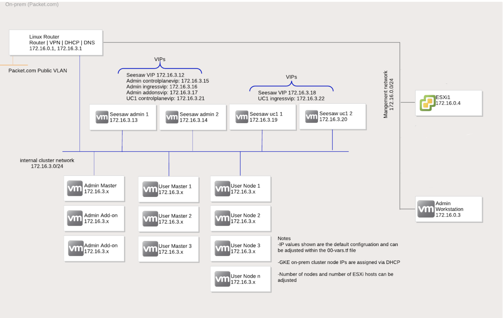

# GKE on prem : Installation guide for Packet

## 0. Target architecture :



## 1. Provision a packet environment

First, clone this repo : `https://github.com/packet-labs/google-anthos` and follow the **Prerequisites** steps

Use the helper script located in the Anthos directory called create_service_accounts.sh to create these keys, assign the IAM roles, and activate the APIs. The script will allow you to log into GCP with your user account and select your Anthos white listed project. You'll also have an option to create a GCP service account to read from the GCS bucket. If you choose this option, you will create a storage-reader-key.json.

You can run this script as follows:

`anthos/create_service_accounts.sh`

Prompts will guide you through the setup.

Setup your terraform variables in a file named `terraform.tfvars`. Content should be similar to:

```sh
auth_token = "PACKET_PERSONAL_API_TOKEN" #Update this line
organization_id = "PACKET_ORG_ID" #Update this line
project_name = "PACKET_PROJECT_NAME" #Update this line
create_project = false
project_id = "PACKET_PROJECT_ID" #Update this line
anthos_gcp_project_id = "GCP_PROJECT_NAME" #Update this line
gcs_bucket_name = "aflalo-bucket-anthos/packet" #Update this line
vcenter_iso_name = "VMware-VCSA-all-6.7.0-15132721.iso" #Update this line
#anthos_version = "1.4.0-gke.13"
anthos_user_cluster_name = "vmware-cluster-1"
esxi_host_count = 1
anthos_datastore = "datastore1"
anthos_deploy_clusters = "False"
anthos_deploy_workstation_prereqs = false
facility = "dfw2"
anthos_user_master_replicas = 1
```

In this setup we'll use only 1 ESXI host for cost optimization.

⚠️  It's strongly recommended from here to **work in a screen / tmux** window to not lose your progression while provisioning your environment  ⚠️

Run : `python3 check_capacity.py``

The output should look similar to this:

```none
Are there 2 c3.medium.x86 instances available for all servers in dfw2?
Yes
```

If it's not the case, change the line `facility = xxx` to `ams1` and re-run python script

Run : `terraform apply --auto-approve`

The setup should take around 30 minutes or more (some colleagues reported setups up to 1h30). Be patient  ⏱

**Note:** If you already used the packet project to deploy, make sure you no longer have any VLAN set in **IPs & Networks** -> **Layer 2** or your setup will go on error after provisioning the ESXI machine

The output should look similar to this:

```none
Outputs:

KSA_Token_Location = The user cluster KSA Token (for logging in from GCP) is located at ./ksa_token.txt
SSH_Key_Location = An SSH Key was created for this environment, it is saved at ~/.ssh/aflalo-sandbox-20201005123231-key
VPN_Endpoint = 147.75.53.105
VPN_PSK = 77VF*GK!1ub$g5u44HoC
VPN_Password = 7@bt7LN?cpEPg!tg
VPN_User = vm_admin
vCenter_Appliance_Root_Password = e?@!91yPWw9ERn78
vCenter_FQDN = vcva.packet.local
vCenter_Password = ba*!T8Gr9Xa7BL7J
vCenter_Username = Administrator@vsphere.local
```

We now need to delete the admin workstation already created by the script in order to perform a full installation manually

- Connect to the VPN 

Tip for OSX: **System Preferences** -> **Network** ->  **+**  -> Interface : **VPN** & VPN Type: **L2TP over IPSec** -> **Authentication Settings** -> Fill the password (*VPN_Password*) & the Shared Secret (*VPN_PSK*) -> Fill **Server Address** (*VPN_Endpoint*) and **Account Name** (*VPN_User*) -> **Connect** --> **Advanced** --> Tick **Send all traffic over VPN connection** --> **OK**

- Login vCenter using vCenter FQDN.

_Note: In case of using Chrome browser, it might warn you about the site being unsafe. In this case type **“iamunsafe”** into the browser (just click in the white space in the window and then type - not in the address bar; You will not see any text appearing)  to be able to open self-signed websites.
If this does not work, consider using another browser such as Firefox or Safari._

- Click `LAUNCH VSPHERE CLIENT (HTML5)`
- Login with **vCenter_Username** && **vCenter_Password**
- Click on **Packet** -> **Packet-1** and delete **Anthos** resource pool
- Stop **admin-workstation** and delete it : _Actions -> Delete from Disk_


You're now ready to deploy GKE On Prem from scratch ! ✅

## 2. Create an Admin Workstation

For more informations about these steps, please read [Create an admin workstation](https://cloud.google.com/anthos/gke/docs/on-prem/how-to/admin-workstation#download-gkeadm-linux) documentation

For the next steps, we will use `gkeadm`. The binary is provided in this repo but we strongly advise you to get the latest version accordingly to the documentation : 

```sh
gsutil cp gs://gke-on-prem-release-public/gkeadm/1.5.0-gke.27/linux/gkeadm ./
chmod +x gkeadm
```

SSH to the gateway using ssh key generated by the script : `ssh root@147.75.53.105 -i ~/.ssh/aflalo-sandbox-20201005123231-key`

You can see here that gcloud is already installed and you're service account credentials provided previously are also already active. To check it just run `gcloud auth list`.

The output should look similar to this:
```none
root@edge-gateway01:~# gcloud auth list
                           Credentialed Accounts
ACTIVE  ACCOUNT
*       gke-onprem@aflalo-anthos.iam.gserviceaccount.com
        storage-reader-service-account@aflalo-anthos.iam.gserviceaccount.com

To set the active account, run:
    $ gcloud config set account `ACCOUNT`
```

- Install git:

```sh
apt install git
```

- Clone the repository to the gateway:

 ```sh
 git clone https://github.com/aflalo-anthos-demo-playbook/2-gke-onprem-packet.git
 ```

- Copy the vspherecert.pem :

 ```sh
 cp anthos/vspherecert.pem 2-gke-onprem-packet/admin-workstation/
 ```

 If the file is missing, you can generate it by running : 

```sh
openssl s_client -showcerts -verify 5 -connect vcva.packet.local:443 < /dev/null | awk '/BEGIN/,/END/{ if(/BEGIN/){a++}; out="/root/anthos/vspherecert.pem"; print >out}'
```

- Copy gcp_keys folder :

 ```sh
 cp -r anthos/gcp_keys/ 2-gke-onprem-packet/
 ```

- Cd to the folder :

 ```sh
 cd 2-gke-onprem-packet/admin-workstation
 ```

- Open the file `admin-ws-config.yaml`
- Update the vCenter credentials with yours
- Login with an GCP with sufficient privileges to grant permissions for all Service Account soon to be created
- Create the admin workstation :

 ```sh
 ./gkeadm create admin-workstation --auto-create-service-accounts
 ```

The output should look similar to this:

```none
Using config file "admin-ws-config.yaml"...
Running preflight validations...
- Validation Category: Tools
    - [SUCCESS] gcloud
    - [SUCCESS] ssh
    - [SUCCESS] ssh-keygen
    - [SUCCESS] scp

- Validation Category: Config Check
    - [SUCCESS] Config

- Validation Category: SSH Key
    - [SUCCESS] SSH key path

- Validation Category: Internet Access
    - [SUCCESS] Internet access to required domains

- Validation Category: GCP Access
    - [SUCCESS] Read access to GKE on-prem GCS bucket

- Validation Category: vCenter
    - [SUCCESS] Credentials
    - [SUCCESS] Version
    - [SUCCESS] Datacenter
    - [SUCCESS] Datastore
    - [SUCCESS] Resource Pool
    - [SUCCESS] Folder
    - [SUCCESS] Network
    - [SUCCESS] Datadisk

All validation results were SUCCESS.

Reusing VM template "gke-on-prem-admin-appliance-vsphere-1.5.0-gke.27" that already exists in vSphere.
Creating admin workstation VM "gke-admin-ws-200918-145413"... \
Creating admin workstation VM "gke-admin-ws-200918-145413"...  DONE
Waiting for admin workstation VM "gke-admin-ws-200918-145413" to be assigned an IP....
DONE

******************************************
Admin workstation VM successfully created:
- Name:    gke-admin-ws-200918-145413
- IP:      172.16.0.3
- SSH Key: /root/.ssh/gke-admin-workstation
******************************************

Printing gkectl and docker versions on admin workstation...
gkectl version
gkectl 1.5.0-gke.27 (git-865bd625b)

docker version
Client:
 Version:           19.03.2
 API version:       1.40
 Go version:        go1.12.9
 Git commit:        6a30dfca03
 Built:             Mon Sep 30 22:47:02 2019
 OS/Arch:           linux/amd64
 Experimental:      false

Server:
 Engine:
  Version:          19.03.2
  API version:      1.40 (minimum version 1.12)
  Go version:       go1.12.9
  Git commit:       6a30dfca03
  Built:            Mon Sep 30 22:42:07 2019
  OS/Arch:          linux/amd64
  Experimental:     false
 containerd:
  Version:          1.2.10-0ubuntu1~18.04.0.1
  GitCommit:
 runc:
  Version:          spec: 1.0.1-dev
  GitCommit:
 docker-init:
  Version:          0.18.0
  GitCommit:


Checking NTP server on admin workstation...
ntptime
ntp_gettime() returns code 0 (OK)
  time e32613e4.5ed42c3c  Mon, Oct  5 2020 21:51:32.370, (.370425009),
  maximum error 13500 us, estimated error 0 us, TAI offset 0
ntp_adjtime() returns code 0 (OK)
  modes 0x0 (),
  offset 59.439 us, frequency 0.083 ppm, interval 1 s,
  maximum error 13500 us, estimated error 0 us,
  status 0x2001 (PLL,NANO),
  time constant 2, precision 0.001 us, tolerance 500 ppm,

Getting whitelisted service account...

Creating other service accounts and JSON key files...
    - log-mon-sa-2010052151
    - connect-agent-sa-2010052151
    - connect-register-sa-2010052151

Enabling APIs...
    - project aflalo-anthos (for gke-onprem)
        - serviceusage.googleapis.com
        - iam.googleapis.com
        - cloudresourcemanager.googleapis.com

Configuring IAM roles for service accounts...
    - gke-onprem for project aflalo-anthos
        - roles/serviceusage.serviceUsageViewer
        - roles/iam.serviceAccountCreator
        - roles/iam.roleViewer
    - log-mon-sa-2010052151 for project aflalo-anthos
        - roles/stackdriver.resourceMetadata.writer
        - roles/logging.logWriter
        - roles/monitoring.metricWriter
        - roles/monitoring.dashboardEditor
    - connect-agent-sa-2010052151 for project aflalo-anthos
        - roles/gkehub.connect
    - connect-register-sa-2010052151 for project aflalo-anthos
        - roles/gkehub.admin
        - roles/serviceusage.serviceUsageViewer

Copying files to admin workstation...
    - /root/2-gke-onprem-packet/admin-workstation/vspherecert.pem
    - log-mon-sa-2010052151.json
    - connect-agent-sa-2010052151.json
    - connect-register-sa-2010052151.json
    - /root/2-gke-onprem-packet/gcp_keys/whitelisted-key.json


Preparing "admin-cluster.yaml" for gkectl...
Preparing "user-cluster.yaml" for gkectl...

********************************************************************
Admin workstation is ready to use.

WARNING: file already exists at "/root/2-gke-onprem-packet/admin-workstation/gke-admin-ws-200918-145413". Overwriting.
Admin workstation information saved to /root/2-gke-onprem-packet/admin-workstation/gke-admin-ws-200918-145413
This file is required for future upgrades
SSH into the admin workstation with the following command:
ssh -i /root/.ssh/gke-admin-workstation ubuntu@172.16.0.3
********************************************************************
```

- Run : `ssh -i /root/.ssh/gke-admin-workstation ubuntu@172.16.0.3`

Congrats 🎉  ! You've successfully deployed the admin workstation  🛠

In case of error, it might be better to delete the admin workstation, ssh keys and re-run gkeadm

## 3. Create an Admin Cluster

You are now logged in the Admin Workstation. We will use it to deploy our admin cluster and then a user cluster

Run `ls -l`

The output should look similar to this : 

```none
ubuntu@gke-admin-ws-200918-145413:~$ ls -l
total 32
-rw-r--r-- 1 ubuntu ubuntu 6368 Oct  5 18:00 admin-cluster.yaml
-rw------- 1 ubuntu ubuntu 2348 Oct  5 18:00 connect-agent-sa-2010051759.json
-rw------- 1 ubuntu ubuntu 2354 Oct  5 18:00 connect-register-sa-2010051759.json
-rw------- 1 ubuntu ubuntu 2336 Oct  5 18:00 log-mon-sa-2010051759.json
drwxrwxr-x 2 ubuntu ubuntu 1024 Oct  5 17:59 logs
-rw-r--r-- 1 ubuntu ubuntu 9413 Oct  5 18:00 user-cluster.yaml
-rw-r--r-- 1 ubuntu ubuntu 1436 Oct  5 18:00 vspherecert.pem
-rw-r--r-- 1 ubuntu ubuntu 2314 Oct  5 18:00 whitelisted-key.json
```

- Let's clone this repo again :

```sh
git clone https://github.com/aflalo-anthos-demo-playbook/2-gke-onprem-packet.git
```

- Create a gcp_keys folder :

```sh
mkdir 2-gke-onprem-packet/gcp_keys
```

- Move all keys into it :

```sh
cp *.json 2-gke-onprem-packet/gcp_keys/
```

- Copy the vspherecert.pem :

```sh
cp vspherecert.pem 2-gke-onprem-packet/
```

- Enter repo folder : `cd 2-gke-onprem-packet/`
- Update vCenter credentials for `admin-cluster/admin-cluster.yaml`
- Update the GCP project id for `admin-cluster/admin-cluster.yaml` in :

```yaml
stackdriver:
  projectID:
```

- Update `admin-cluster/admin-cluster.yaml` with your the service account's name used for logs :

```sh
sed -i 's/log-mon-sa-2009181532/YOUR_SA_NAME/g' admin-cluster/admin-cluster.yaml
```

- After modifying the configuration file, run `gkectl check-config` to verify that the file is valid and can be used for installation:

```sh
gkectl check-config --config admin-cluster/admin-cluster.yaml
```

The output should look similar to this :

```none
ubuntu@gke-admin-ws-200918-145413:~/2-gke-onprem-packet$ gkectl check-config --config admin-cluster/admin-cluster.yaml
- Validation Category: Config Check
    - [SUCCESS] Config

- Validation Category: Internet Access
    - [SUCCESS] Internet access to required domains

- Validation Category: GCP
    - [SUCCESS] GCP service
    - [SUCCESS] GCP service account

- Validation Category: Docker Registry Credential
    - [SUCCESS] Docker registry access

- Validation Category: Admin Cluster VCenter
    - [SUCCESS] Credentials
    - [SUCCESS] Version
    - [SUCCESS] Datacenter
    - [SUCCESS] Datastore
    - [SUCCESS] Resource pool
    - [SUCCESS] Folder
    - [SUCCESS] Network
    - [SUCCESS] Data disk

- Validation Category: Bundled LB
    - [SUCCESS] Seesaw validation

- Validation Category: Network Configuration
    - [SUCCESS] CIDR, VIP and static IP (availability and overlapping)

- Validation Category: DNS
    - [SUCCESS] DNS (availability)

- Validation Category: TOD
    - [SUCCESS] TOD (availability)

- Validation Category: VIPs
    - [SUCCESS] Ping (availability)

- Validation Category: Node IPs
    - [SUCCESS] Ping (availability)

Now running slow validation checks. Press ctrl-c twice to cancel. Use flag --fast to disable. Use flag --cleanup=false to keep the test VMs for debugging afterwards.

Using OS image OVA file: "/tmp/gke-on-prem-bundle-cache/770007/gke-on-prem-ubuntu-1.5.0-gke.27.ova"
Setting up OS image as a VM template in vSphere...
[07-10-20 17:08:40] Uploading OS image "gke-on-prem-ubuntu-1.5.0-gke.27" to vSphere...OK
Creating test VMs with admin cluster configuration...  DONE
Waiting to get IP addresses from test VMs...  DONE
Waiting for test VMs to become ready...  DONE

- Validation Category: Internet Access
    - [SUCCESS] Internet access to required domains

- Validation Category: VCenter on Test VMs
    - [SUCCESS] Test VM: VCenter access and permission

- Validation Category: DNS on Test VMs
    - [SUCCESS] Test VM: DNS availability

- Validation Category: TOD on Test VMs
    - [SUCCESS] Test VM: TOD availability

- Validation Category: Docker Registry
    - [SUCCESS] Docker registry access
    - [SUCCESS] gcr.io/gke-on-prem-release access

Deleting test VMs with admin cluster configuration...  DONE
All validation results were SUCCESS.
```

- Run gkectl prepare to initialize your vSphere environment:

```sh
gkectl prepare --config=admin-cluster/admin-cluster.yaml
```

The output should look similar to this :

```none
ubuntu@gke-admin-ws-200918-145413:~/2-gke-onprem-packet$ gkectl prepare --config=admin-cluster/admin-cluster.yaml
Reading config with version "v1"
- Validation Category: Config Check
    - [SUCCESS] Config

- Validation Category: Internet Access
    - [SUCCESS] Internet access to required domains

- Validation Category: GCP
    - [SUCCESS] GCP service
    - [SUCCESS] GCP service account

- Validation Category: GCR Credential
    - [SUCCESS] gcr.io/gke-on-prem-release access

- Validation Category: Docker Registry Credential
    - [SKIPPED] Docker registry access: No registry config specified

- Validation Category: Admin Cluster VCenter
    - [SUCCESS] Credentials
    - [SUCCESS] Version
    - [SUCCESS] Datacenter
    - [SUCCESS] Datastore
    - [SUCCESS] Resource pool
    - [SUCCESS] Folder
    - [SUCCESS] Network

Some validations were SKIPPED. Check the report above.
Logging in to gcr.io/gke-on-prem-release
Reusing VM template "gke-on-prem-ubuntu-1.5.0-gke.27" that already exists in vSphere.
Using OS image OVA file: "/tmp/gke-on-prem-bundle-cache/770007/seesaw-os-image-v1.5-20200911-1fd66a0184.ova"
Setting up OS image as a VM template in vSphere...
[07-10-20 17:12:48] Uploading OS image "seesaw-os-image-v1.5-20200911-1fd66a0184" to vSphere...OK
```

- Create Seesaw loadbalancer:

```sh
gkectl create loadbalancer --config admin-cluster/admin-cluster.yaml
```

The output should look similar to this :

```none
ubuntu@gke-admin-ws-200918-145413:~/2-gke-onprem-packet$ gkectl create loadbalancer --config admin-cluster/admin-cluster.yaml
Reading config with version "v1"
- Validation Category: Admin Cluster VCenter
    - [SUCCESS] Credentials
    - [SUCCESS] Version
    - [SUCCESS] Datacenter
    - [SUCCESS] Datastore
    - [SUCCESS] Resource pool
    - [SUCCESS] Folder
    - [SUCCESS] Network

- Validation Category: Bundled LB
    - [SUCCESS] Seesaw validation

- Validation Category: Network Configuration
    - [SUCCESS] CIDR, VIP and static IP (availability and overlapping)

All validation results were SUCCESS.

Creating 1 LB VMs in group "seesaw-for-gke-admin"...  DONE
Saved Seesaw group information of "seesaw-for-gke-admin" to file: admin-cluster/seesaw-for-gke-admin.yaml
Waiting LBs in group "seesaw-for-gke-admin" to become healthy...  DONE
```

- Before creating the admin cluster, we need to create a Monitoring workspace inside GCP console. All you need to do is open `Monitoring`from the menu on the console and wait for your workspace to be created

- Finally create the admin cluster:

```sh
gkectl create admin --config admin-cluster/admin-cluster.yaml
```

The output should look similar to this :

```none
ubuntu@gke-admin-ws-200918-145413:~/2-gke-onprem-packet$ gkectl create admin --config admin-cluster/admin-cluster.yaml
Reading config with version "v1"
- Validation Category: Config Check
    - [SUCCESS] Config

- Validation Category: OS Images
    - [SUCCESS] Admin cluster OS images exist

- Validation Category: Cluster Version
    - [SUCCESS] Cluster versions for creating admin cluster

- Validation Category: Reserved IPs
    - [SKIPPED] Admin cluster reserved IP for new user master: No AdminClusterClient

- Validation Category: Internet Access
    - [SUCCESS] Internet access to required domains

- Validation Category: GCP
    - [SUCCESS] GCP service
    - [SUCCESS] GCP service account

- Validation Category: Docker Registry Credential
    - [SUCCESS] Docker registry access

- Validation Category: Admin Cluster VCenter
    - [SUCCESS] Credentials
    - [SUCCESS] Version
    - [SUCCESS] Datacenter
    - [SUCCESS] Datastore
    - [SUCCESS] Resource pool
    - [SUCCESS] Folder
    - [SUCCESS] Network
    - [SUCCESS] Data disk

- Validation Category: Bundled LB
    - [SUCCESS] Seesaw validation

- Validation Category: Network Configuration
    - [SUCCESS] CIDR, VIP and static IP (availability and overlapping)

- Validation Category: DNS
    - [SUCCESS] DNS (availability)

- Validation Category: TOD
    - [SUCCESS] TOD (availability)

- Validation Category: VIPs
    - [SUCCESS] Ping (availability)

- Validation Category: Node IPs
    - [SUCCESS] Ping (availability)

Some validations were SKIPPED. Check the report above.
DEBUG: docker/images.go:70] Pulling image: gcr.io/gke-on-prem-release/kindest/node:v0.6.1-gke.8-v1.17.7-gke.0 ...
 ✓ Ensuring node image (gcr.io/gke-on-prem-release/kindest/node:v0.6.1-gke.8-v1.17.7-gke.0) 🖼
 ✓ Preparing nodes 📦
 ✓ Writing configuration 📜
 ✓ Starting control-plane 🕹️
 ✓ Installing CNI 🔌
Could not read storage manifest, falling back on old k8s.io/host-path default ...
 ✓ Installing StorageClass 💾
 ✓ Waiting ≤ 5m0s for control-plane = Ready ⏳
 • Ready after 59s 💚
    Waiting for external cluster control plane to be healthy...  DONE
    Applying vSphere certificate configmap to external cluster...  DONE
    Applying vSphere credentials secret to external cluster...  DONE
    Creating data disk for internal cluster....  DONE
Applying admin bundle to external cluster...  DONE
    Waiting for cluster to be ready for external cluster...  DONE
Provisioning master vm for internal cluster via external cluster
    Creating cluster object  on external cluster...  DONE
    Creating master...  DONE
    Updating external cluster object with master endpoint...  DONE
Creating internal cluster
    Getting internal cluster kubeconfig...  DONE
    Waiting for internal cluster control plane to be healthy...  DONE
    Applying docker registry [gcr.io/gke-on-prem-release] credentials secret to internal
cluster...  DONE
    Applying vSphere certificate configmap to internal cluster...  DONE
    Applying vSphere credentials secret to internal cluster...  DONE
    Applying Seesaw credentials secret to internal cluster...  DONE
    Checking Bundle requirements...  DONE
    Applying Bundle CRDs...  DONE
    Applying Bundle YAML...  DONE
    Applying admin base bundle to internal cluster...  DONE
    Pivoting Cluster API objects from external to internal cluster...  DONE
    Waiting for kube-apiserver VIP to be configured on the internal cluster...  DONE
Creating node Machines in internal cluster...  DONE
Applying admin addon bundle to internal cluster...  DONE
Waiting for admin cluster machines and pods to be ready...  DONE
Cleaning up external cluster...  DONE
Creating dashboards in Cloud Monitoring
Done provisioning Admin Control Plane cluster. You can access it with `kubectl --kubeconfig kubeconfig`
```

Congrats 🎉  ! You're admin cluster is up and running !

## 4. Create a User Cluster

- Update the file with your SA names using sed

If all your SA are named by default and have the same id use:

```sh
sed -i 's/2009181532/YOUR_SA_ID/g' user-cluster/user-cluster.yaml
```

Else:

```sh
sed -i 's/log-mon-sa-2009181532/YOUR_SA_NAME/g' user-cluster/user-cluster.yaml
```

```sh
sed -i 's/connect-register-sa-2009181532/YOUR_SA_NAME/g' user-cluster/user-cluster.yaml
```

```sh
sed -i 's/connect-agent-sa-2009181532/YOUR_SA_NAME/g' user-cluster/user-cluster.yaml
```

- Update `projectID` value to your GCP Project value

- After you've modified the configuration file, run gkectl check-config to verify that the file is valid and can be used for installation:

```sh
gkectl check-config --kubeconfig kubeconfig --config user-cluster/user-cluster.yaml
```

The output should look similar to this :

```none
ubuntu@gke-admin-ws-200918-145413:~/2-gke-onprem-packet$ gkectl check-config --kubeconfig kubeconfig --config user-cluster/user-cluster.yaml
- Validation Category: Config Check
    - [SUCCESS] Config

- Validation Category: Internet Access
    - [SUCCESS] Internet access to required domains

- Validation Category: GCP
    - [SUCCESS] GCP service
    - [SUCCESS] GCP service account

- Validation Category: GKEHub
    - [SUCCESS] GKEHub new membership

- Validation Category: Docker Registry Credential
    - [SUCCESS] Docker registry access

- Validation Category: User Cluster VCenter
    - [SUCCESS] Credentials
    - [SUCCESS] Version
    - [SUCCESS] Datacenter
    - [SUCCESS] Datastore
    - [SUCCESS] Resource pool
    - [SUCCESS] Folder
    - [SUCCESS] Network
    - [SUCCESS] Datastore

- Validation Category: Bundled LB
    - [SUCCESS] Seesaw validation

- Validation Category: Network Configuration
    - [SUCCESS] CIDR, VIP and static IP (availability and overlapping)

- Validation Category: DNS
    - [SUCCESS] DNS (availability)

- Validation Category: TOD
    - [SUCCESS] TOD (availability)

- Validation Category: VIPs
    - [SUCCESS] Ping (availability)

- Validation Category: Node IPs
    - [SUCCESS] Ping (availability)

Now running slow validation checks. Press ctrl-c twice to cancel. Use flag --fast to disable. Use flag --cleanup=false to keep the test VMs for debugging afterwards.

Creating test VMs with user cluster configuration...  DONE
Waiting to get IP addresses from test VMs...  DONE
Waiting for test VMs to become ready...  DONE

- Validation Category: Internet Access
    - [SUCCESS] Internet access to required domains

- Validation Category: VCenter on Test VMs
    - [SUCCESS] Test VM: VCenter access and permission

- Validation Category: DNS on Test VMs
    - [SUCCESS] Test VM: DNS availability

- Validation Category: TOD on Test VMs
    - [SUCCESS] Test VM: TOD availability

- Validation Category: Docker Registry
    - [SUCCESS] Docker registry access

Deleting test VMs with user cluster configuration...  DONE
All validation results were SUCCESS.
```

- Create and configure the VM for your Seesaw load balancer:

```sh
gkectl create loadbalancer --kubeconfig kubeconfig --config user-cluster/user-cluster.yaml
```

The output should look similar to this :

```none
Creating 1 LB VMs in group "seesaw-for-user-cluster"...  DONE
Saved Seesaw group information of "seesaw-for-user-cluster" to file: user-cluster/seesaw-for-user-cluster.yaml
Waiting LBs in group "seesaw-for-user-cluster" to become healthy...  DONE
```

- Create your user cluster:

```sh
gkectl create cluster --kubeconfig kubeconfig --config user-cluster/user-cluster.yaml
```

The output should look similar to this :

```none
All validation results were SUCCESS.
Waiting for user cluster "user-cluster" to be ready...  DONE
    Creating or updating master node...
    Creating or updating user cluster control plane workloads: 10/11 pods are ready...
    Creating or updating node pools: "pool-1": 0/3 replicas are ready...
    Creating or updating addon workloads: 10/31 pods are ready...
    Creating or updating addon workloads: 16/31 pods are ready...
    Creating or updating addon workloads: 22/37 pods are ready...
    Creating or updating addon workloads: 31/38 pods are ready...
    Creating or updating addon workloads: 35/39 pods are ready...
    Cluster is running...
Done provisioning user cluster user-cluster. You can access it with `kubectl --kubeconfig user-cluster-kubeconfig`
```

- The last step is login to your newly created user cluster. We will use a Token Authentication.

Run :

```sh
export KUBECONFIG=/home/ubuntu/2-gke-onprem-packet/user-cluster-kubeconfig
export KSA_NAME=gke-connect-admin
kubectl create serviceaccount $KSA_NAME
kubectl create clusterrolebinding $KSA_NAME --clusterrole cluster-admin --serviceaccount=default:$KSA_NAME
TOKEN_SECRET=`kubectl get serviceaccounts $KSA_NAME -o yaml | grep $KSA_NAME-token | awk -F": " '{print $2}'`
echo `kubectl get secret $TOKEN_SECRET -o yaml | grep "token:" | awk -F": " '{print $2}' | base64 -d` > ksa-token.txt
```

- Go to GCP console, Kubernetes Engine, Clusters, Login, Choose Token and paste ksa-token.txt content

### Relax and enjoy your cluster 🥂